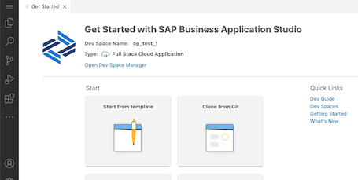
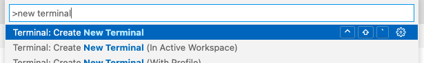
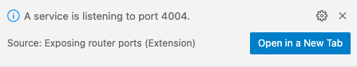

In the following we describe how to get started with the _Incidents Management_ application, which we use throughout the exercises.

## Set Up SAP Business Application Studio

Follow these tutorials to
- [Create a free tier account](https://developers.sap.com/tutorials/btp-free-tier-account.html) on SAP BTP
- [Set up SAP Business Application Studio](https://developers.sap.com/tutorials/appstudio-onboarding.html)

## Open SAP Business Application Studio

1. **Start Google Chrome** (BAS runs best with that browser)
2. **Open** the URL of your SAP Business Application Studio subscription
3. **Log in** with the your personal credentials
4. **Create a dev space** of type **Full Stack Cloud Application** (might take a few minutes).
5. **Enter the dev space** by clicking on it's title  → a page like this appears:

  

## Clone and Open the Project

**Open a terminal** (press <kbd>F1</kbd>, type _New terminal_, or use the main menu)



In the terminal, run:

```sh
cd projects

git clone https://github.com/SAP-samples/teched2023-AD264
```

Then open the project using the **Open Folder** command (<kbd>F1</kbd> > _Open folder_).
Select the cloned project folder _projects > teched2023-AD264_ like this and press _OK_:

In the new workspace, again **open a terminal**, and run

```sh
cd incidents
npm install
npm add @sap-cloud-sdk/http-client
npm install -g @sap/cds-dk
```

This installs the necessary modules for the `incidents` application plus the [SAP Cloud SDK HTTP Client](https://sap.github.io/cloud-sdk/docs/js/overview-cloud-sdk-for-javascript), which helps with remote communication.<br>

The `cds` command line tool is updated as well to the latest version.

## Inspect the Application

Let's see what we got in the project.  The conceptual domain model for this _Incidents Management_ application is as follows:

- *Customers* can create *Incidents* (either directly or via agents)
- *Incidents* have a title and a *Conversation* of several *Messages*
- *Incidents* are resolved through *repairs*, kept track of as scheduled *Appointments* of available *Service Workers*


A condensed version in the [CDS language](https://cap.cloud.sap/docs/cds/cdl) is as follows:

```cds
entity Customers {
  name      : String;
}

entity Incidents {
  title        : String;
  customer     : Association to Customers;
  conversation : Composition of many {
    timestamp  : DateTime;
    author     : String;
    message    : String;
  };
  repair       : Association to Appointments;
}

entity Appointments {
  start  : DateTime;
  end    : DateTime;
  worker : Association to ServiceWorkers;
}

entity ServiceWorkers {
  name         : String;
  appointments : Association to many Appointments;
}
```

> [Learn more about Domain Modeling in CAP](https://cap.cloud.sap/docs/guides/domain-models)


Now try the following:

1. Find `db/schema.cds` in the file explorer
2. Open it in CDS Text Editor.
3. Alternatively, use _Open with... > CDS Graphical Modeller_ in SAP Business Application Studio

<details>
<summary>Which entity is missing?</summary>

The _Customers_ entity is missing at the moment.

</details>

## Your Tasks

You task in the following exercises is to
- Define _Customers_
- Not as a 'normal' local entity, though
- But as a projection on a remote entity of an SAP S/4HANA system
- So that at runtime the customer data comes from the remote system
- With as minimal load as possible to the remote system
- Integrate it nicely into the rest of the data model

## Run the Application

First things first, let's **run the application**.  In the terminal, execute in the `incidents` folder:

```sh
cds watch
```

> In the following exercises, always use the `incidents` folder as **working directory** in the terminal (unless stated otherwise).  If you get errors like `no model found`, this usually means you are in the wrong folder.

In SAP Business Application Studio, wait for the little popup in the bottom right corner to appear.  Click **Open in a New Tab**:



It might be that the new browser tab is **blocked**.  If this happens, no worries:
- Unblock future popups from this host.  See the address bar for the little popup manager icon.
- Press <kbd>Ctrl+C</kbd> in the terminal, and run `cds watch` again.

> Tip: You can always open a _running_ application's tab using the _Ports Preview_ command.  Use <kbd>F1</kbd> and type _Ports_ to find the command.

The application should have come up with an address like `https://port4004-workspaces-ws-...applicationstudio.cloud.sap/` (if you work locally, this would be http://localhost:4004).

On the application's index page, go to **Incidents → Fiori preview**, which opens an SAP Fiori elements list page for the `Incidents` entity.  It should look like this:


> With regards to the UI screens that you see here: this is not a tutorial on SAP Fiori.  Instead, we use the minimal screens necessary to illustrate the relevant points.  For a full-fledged SAP Fiori Elements application using CAP, see the [SFlight application](https://github.com/SAP-samples/cap-sflight/).

## Summary

Now that you have a first version of the application running, continue to the [first exercise](../ex1/README.md).


## Appendix: Start in VS Code

Alternatively, you may want to start in VS Code.  Do it like so:

```sh
git clone https://github.com/SAP-samples/teched2023-AD264
cd teched2023-AD264/incidents
npm install
npm add @sap-cloud-sdk/http-client
npm install -g @sap/cds-dk
code .  # opens VS Code
```
