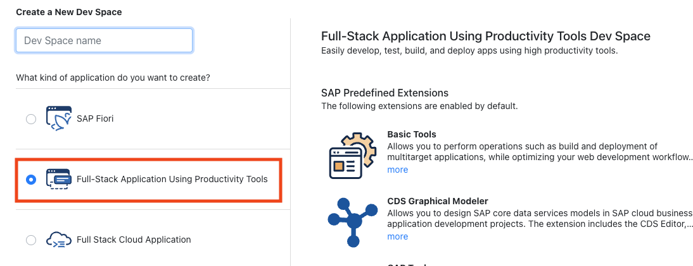

# Guided Hands-on Sessions

This is **only** relevant for guided hands-on sessions by SAP, like SAP TechEd.

## Logon to Shared Account

👉 Log on to **https://lcapteched.eu10cf.applicationstudio.cloud.sap/**

- Your **user** is
    ```
    lowcodeuser+01XX@gmail.com
    ```
    where `XX` is a number.  This number is assigned to you by the moderator.
- The **password** is given to you by the moderator as well.

<p>

👉 Click on the **dev space** given by the moderator. If it's stopped, start it by clicking on the _Play_ icon.

<details>
<summary>No dev space available?</summary>

Select _Full-Stack Application Using Productivity Tools_, enter an arbitrary name.


</details>


## Disclaimer

There is **no guarantee** that this account is available after the session.  Also, please refrain from sharing the credentials.
