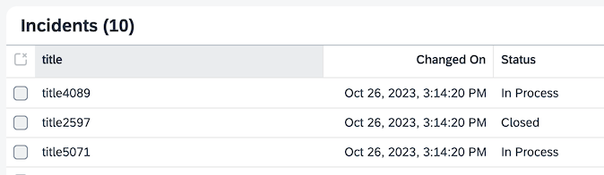

# Exercise 1 - Introduction to CAP

In this exercise, you will build a small application with SAP Cloud Application Programming Model (CAP).

You will use this application scenario throughout the exercises.
Also, you will get familiar with CAP and the CDS language.

The conceptual domain model for this _Incidents Management_ application is as follows:

- *Customers* can create *Incidents* (either directly or via agents)
- *Incidents* have a title, a status and and urgency level
- *Incidents* contain a *Conversation* history consisting of several messages

<p>


## Create a Project

👉 In SAP Business Application Studio, create a new _CAP Project_ through the project wizard.
- Name it `incidents-mgt`, for example.
- Accept the rest of the defaults.  No sample code needed; you will fill the project as you go.

<details>
<summary>These screenshots help you find the project wizard:</summary>


</details>
<p>

> You might also create the project with `cds init incidents-mgt` on the command line in the `/home/user/projects` folder.


## Add Incidents

You should now have (been) switched to a new workspace with the created project.

👉 Open the file explorer again.

👉 Create a file `data-model.cds` in the `db` folder.
- There, add an `Incidents` [entity](https://cap.cloud.sap/docs/cds/cdl#entities) with a key field `ID` and a `title`.
- Choose appropriate data types.  Use code completion (intellisense) to pick a fitting data type.
- Also, add a namespace `incidents.mgt` to the beginning of the file, so that the entity's full name is `incidents.mgt.Incidents`

<details>
<summary>This is how it should like:</summary>

```cds
namespace incidents.mgt;

entity Incidents {
  key ID       : UUID;
  title        : String;
}
```
</details>

## Use Predefined Aspects

The situation of `ID` key fields is so common that there is a prebuilt CDS aspect available named [`cuid`](https://cap.cloud.sap/docs/cds/common#aspect-cuid) that provides just that.<br>
It can be imported with `using ... from '@sap/cds/common';` and used in an entity with the `:` (colon) syntax.

Also, the `Incidents` entity shall carry information on when it was created and updated and by whom.  There is a [`managed` aspect from `@sap/cds/common`](https://cap.cloud.sap/docs/cds/common#aspect-managed) that does that.

👉 Make use of the two aspects and:
- Replace the hand-crafted `ID` field with [`cuid`](https://cap.cloud.sap/docs/cds/common#aspect-cuid)<br>
- Add the [`managed`](https://cap.cloud.sap/docs/cds/common#aspect-managed) aspect.


<details>
<summary>This is how it should like:</summary>

```cds
using { cuid, managed } from '@sap/cds/common';

namespace incidents.mgt;

entity Incidents : cuid, managed {
  title        : String;
}
```
</details>

<p>

👉 Take a few moments and check out what the `@sap/cds/common` package has to offer in addition.  In the editor, hold <kbd>Ctrl</kbd> (or <kbd>⌘</kbd>) and hover over the `managed` text.  Click to navigate inside.
See the [documentation](https://cap.cloud.sap/docs/cds/common) for more.


## Add a Conversation History

An incident shall hold a number of messages to build a conversation history.

To create such a relationship, the **graphical CDS modeler** in SAP Business Application Studio is a great tool.<br>
👉 Open it for the `data-model.cds` file using one of two options:
- Right click the `data-model.cds` file.  Select `Open With` > `CDS Graphical Modeler`
- Or open the modeler through the project **Storyboard**:
  - Press <kbd>F1</kbd> > `Open Storyboard`
  - Click on the `Incidents` entity > `Open in Graphical Modeler`

👉 In its canvas, add a `Conversations` entity.
- In the `Aspects` tab in the property sheet, add the `ID` key field from CDS aspect `cuid`.
- Add `timestamp`, `author`, and `message` fields with appropriate types.

👉 Now **connect** the two entities.
- Hover over the `Incidents` entity and find the `Add Relationship` button from the flyout menu.  Drag it **from** `Incidents` **to** the `Conversations` entity.
- In the `New Relationship` dialog:
  - Choose a relationship type so that whenever an `Incident` instance is deleted, all its conversations are deleted as well.
  - Stay with the proposed `conversations` and `incidents` fields.


<details>
<summary>All in all, the entities shall look like this:</summary>


As text, it looks like this. Note the `Composition` between the two entities.

```cds
using { cuid, managed } from '@sap/cds/common';

namespace incidents.mgt;

entity Incidents : cuid, managed {
  title         : String(100);
  conversations : Composition of many Conversations on conversations.incidents = $self;
}

entity Conversations : cuid, managed {
  timestamp : DateTime;
  author    : String(100);
  message   : String;
  incidents : Association to Incidents;
}
```

</details>

> To open the code editor, just double-click on the `db/data-model.cds` file in the explorer tree.

<!-- > In the following exercises, feel free to use the graphical modeler or the code editor as you like. Find out what works for you.<br>
In the solutions though, we will print the textual form, as it's more convenient to copy/paste. -->


## Add Status and Urgency

Incidents shall have two more fields `status` and `urgency`, which are 'code lists', i.e. configuration data.

👉 Add two entities, using the [`sap.common.CodeList`](https://cap.cloud.sap/docs/cds/common#aspect-codelist) aspect.
- `Status` for the incident's status like _new_, _in process_ etc.
  - Name its key field `code`
- `Urgency` to denote the priority like _high_, _medium_ etc.
  - Name its key field `code`

👉 Add one [association](https://cap.cloud.sap/docs/guides/domain-modeling#associations) to `Incidents` pointing to the each new entity.  The associations shall be _unidirectional_ only, i.e. pointing _from_ `Incidents` to `Status` or `Urgency`, but not in the other direction.

<details>
<summary>See the result:</summary>

In `db/data-model.cds`, add:

```cds
using { sap.common.CodeList } from '@sap/cds/common';

entity Status : CodeList {
  key code  : String;
}

entity Urgency : CodeList {
  key code : String;
}

entity Incidents {
  ...
  urgency       : Association to Urgency;
  status        : Association to Status;
};
```

</details>

## Create a CDS Service

There shall be an API for incidents processors to maintain incidents.

👉 In a new file `srv/processor-service.cds`, create a [CDS service](https://cap.cloud.sap/docs/cds/cdl#service-definitions) that exposes a one-to-one projection on `Incidents`.<br>

<details>
<summary>This is how the service should like:</summary>

```cds
using { incidents.mgt } from '../db/data-model';

service ProcessorService {

  entity Incidents as projection on mgt.Incidents;

}
```

</details>

## Start the Application

👉 Run the application:
- Open a terminal.  Press <kbd>F1</kbd>, type _new terminal_, or use the main menu.
- In the terminal, execute in the project root folder:

  ```sh
  cds watch
  ```

  <details>
  <summary>See the console output:</summary>

  
  </details>

  <p>

Take a moment and check the output for what is going on:

- The application consists of three `cds` files.  Two are application sources and one comes from the `@sap/cds` library:
  ```sh
  [cds] - loaded model from 3 file(s):

    srv/processor-service.cds
    db/data-model.cds
    .../@sap/cds/common.cds
  ```

- An in-memory [SQLite database](https://cap.cloud.sap/docs/guides/databases-sqlite) got created.  This holds the application data (which we don't have yet).
  ```sh
  [cds] - connect to db > sqlite { database: ':memory:' }
  /> successfully deployed to in-memory database.
  ```

- The CDS service got exposed on this path:
  ```sh
  [cds] - serving ProcessorService { path: '/odata/v4/processor' }
  ```


👉 Now <kbd>Ctrl+Click</kbd> on the `http://localhost:4004` link in the terminal.
- In SAP Business Application Studio, this URL gets automatically transformed to an address like `https://port4004-workspaces-ws-...applicationstudio.cloud.sap/`
- If you work locally, this would be http://localhost:4004.

On the index page, all endpoints are listed along with the entities that they expose.


The _Fiori preview_ link you will use later.

👉 Do you know why the service URL path is `/processor`?  What's the `$metadata` link?

<details>
<summary>Here is why:</summary>

You named the CDS service `ProcessorService`, and the runtime system infers the URL `processor` by stripping off `Service`.  You can configure this explicitly using the [`@path` annotation](https://cap.cloud.sap/docs/node.js/cds-serve#path).

The `$metadata` URL serves the metadata document required for the [OData protocol](https://cap.cloud.sap/docs/advanced/odata).  You will soon see OData in action.

</details>

## Add Sample Data

Add some test data to work with.

👉 Create empty **csv files** for all entities.  In a new terminal, run:

```sh
cds add data
```


As soon as they are there, `cds watch` finds and deploys them to the database. Check the console output:

```sh
[cds] - connect to db > sqlite { database: ':memory:' }
> init from db/data/incidents.mgt-Urgency.texts.csv
> init from db/data/incidents.mgt-Urgency.csv
> init from db/data/incidents.mgt-Status.texts.csv
> init from db/data/incidents.mgt-Status.csv
> init from db/data/incidents.mgt-Incidents.csv
> init from db/data/incidents.mgt-Conversations.csv
```

> Note how the files names match the entity names.

Now fill in some content:

👉 For the two code lists, **add csv records in the terminal** real quick:

```sh
cat << EOF > db/data/incidents.mgt-Status.csv
code,name
N,New
I,In Process
C,Closed
EOF

cat << EOF > db/data/incidents.mgt-Urgency.csv
code,name
H,High
M,Medium
L,Low
EOF
```

👉 For the `Incidents` and `Conversations` csv files, use the **sample data editor** to fill in some data.
- Double click on the `db/data/incidents.mgt-Incidents.csv` file in the explorer tree.
- In the editor, add maybe 10 rows.  Use the `Number of rows` field and click `Add` to create the records.
- Also create records for the `db/data/incidents.mgt-Conversations` file. The editor automatically fills the `incidents_ID` foreign key.

👉 On the applications index page, click on the `Incidents` link which runs a `GET /odata/v4/processor/Incidents` request.<br>


## Add a Simple UI

👉 Click on _Incidents_ > _[Fiori Preview](https://cap.cloud.sap/docs/advanced/fiori#sap-fiori-preview)_ on the index page of the application.  This opens an SAP Fiori Elements application that was created on the fly.  It displays the entity's data in a list.

The list seems to be empty although there is data available .  This is because no columns are configured.  Let's change that.

👉 Add a file `app/annotations.cds` with this content:

```cds
using { ProcessorService as service } from '../srv/processor-service';

// enable drafts for editing in the UI
annotate service.Incidents with @odata.draft.enabled;

// table columns in the list
annotate service.Incidents with @UI : {
  LineItem  : [
    { $Type : 'UI.DataField', Value : title},
    { $Type : 'UI.DataField', Value : modifiedAt },
    { $Type : 'UI.DataField', Value : status.name, Label: 'Status' },
    { $Type : 'UI.DataField', Value : urgency.name, Label: 'Urgency' },
  ],
};

// title in object page
annotate service.Incidents with @(
    UI.HeaderInfo : {
      Title : {
        $Type : 'UI.DataField',
        Value : title,
      },
      TypeName : 'Incident',
      TypeNamePlural : 'Incidents',
      TypeImageUrl : 'sap-icon://alert',
    }
);
```

which creates 3 columns:



There is even a preconfigured label for the `modifiedAt` column.<br>
👉 Do you know how to look them up?  Hint: use editor features.

<details>
<summary>See how:</summary>

On the `managed` aspect in `db/data-model.cds`, select _Go to References_ from the context menu.  Expand `common.cds` in the right-hand tree and check the `annotate managed` entries until you see the `@title` annotations:


The actual strings seem to be fetched from a resource bundle that is addressed with a `{i18n>...}` key.  See the [localization guide](https://cap.cloud.sap/docs/guides/i18n) for how this works.

</details>

<p>

The label for the `title` column seems to be wrong, though.<br>
👉 Fix it by adding the appropriate [CDS annotation](https://cap.cloud.sap/docs/advanced/fiori#prefer-title-and-description) to the `Incidents.title` element.

<details>
<summary>This is how you can do it:</summary>

Add a `@title:'Title'` annotation to the `Incidents` definition.  Make sure to place it correctly before the semicolon.  Watch out for syntax errors.

```cds
entity Incidents : cuid, managed {
  title         : String(100) @title : 'Title';   // <--
  ...
}
```

Note that annotations can be added at [different places in the CDS syntax](https://cap.cloud.sap/docs/cds/cdl#annotations).

</details>

## Add Business Logic

Let's add some logic to the application.  When an incident is created with _urgent_ in its title, it shall set its urgency to 'High'.

👉 Add a file `srv/processor-service.js` with this content:

```js
const cds = require('@sap/cds')

class ProcessorService extends cds.ApplicationService {
  async init() {

    this.before('CREATE', 'Incidents', ({ data }) => {
      if (data) {
        const incidents = Array.isArray(data) ? data : [data]
        incidents.forEach(incident => {
          // TODO add code here
        })
      }
    })

    return super.init()
  }
}

module.exports = ProcessorService
```

Note how the `js` file is named the same as the `cds` file.  This is how the framework finds the implementation.  You can can see this in the output of `cds watch`, where it prints the `impl` value:

```sh
...
[cds] - serving ProcessorService { path: '/odata/v4/processor', impl: 'srv/processor-service.js' }
...
```

> Don't see the `js` file listed there?  Check its spelling!

👉 Complete the code with the actual logic: check that the `title` includes `urgent` and in that case set its `urgency code` to `H`.
- Handle `urgent` and `Urgent` in the same way.
- Also be robust in the case that there is no title given.

<details>
<summary>Solution:</summary>

```js
          if (incident.title?.toLowerCase().includes('urgent')) {
            incident.urgency = { code: 'H' }
          }
```
</details>

<p>

👉 Now test the logic by creating an incident through the UI.  Add the word _urgent_ in the title.  After saving it, go back to the list.  You should see the urgency set to _High_.

## Debug the Code (Optional)

If you want to debug the code using the built-in visual Javascript debugger, do this:
- Kill the running `cds watch` process.
- Press <kbd>F1</kbd>, type  _debug terminal_, select _Javascript: Debug Terminal_
- In this terminal, start `cds watch` as usual.  The debugger starts and attaches to this process.
- At the top in the middle of the window, see the floating panel with which you can control the debugger and do step operations.<br>
  
- Set a breakpoint in the source within the `this.before(...` function. Do this by double-clicking next to the line number.<br>
  <details>
  <summary>Quick question: in this situation, why wouldn't the debugger halt outside of this function?</summary>

  Because the `before()` function is a [request handler](https://cap.cloud.sap/docs/node.js/core-services#srv-on-before-after), and it's only such request-handling code that can be debugged now.<br>
  The code above and below is [bootstrap](https://cap.cloud.sap/docs/node.js/cds-server) code that can only be debugged if you either set the breakpoint earlier or make the debugger halt right when the server process gets started.
  </details>
- Now create a new incident.  The UI freezes because the debugger has stopped.
- For variables, press <kbd>F1</kbd>, type  _variables_, select _Run and Debug: Focus on Variables View_.
- After having inspected the variables, don't forget to continue execution using the debug control panel, otherwise the application UI will not react (and timeout eventually).

## Add Another Service

In the service above, you have used only the very minimal form of a [CDS projection](https://cap.cloud.sap/docs/cds/cdl#views-and-projections), which basically does a one-to-one exposure of an entity to the API surface:

```cds
service ProcessorService {
  entity Incidents as projection on mgt.Incidents;
}
```

However, projections go way beyond this and provide powerful means to express queries for specific application scenarios.
- When mapped to relational databases, such projections are in fact translated to SQL views.
- You will soon see non-DB uses of projections.

👉 Now explore projections and services.  Add a 'statistics service' that shows
- Incidents' `title`
- Their `status`, but showing `New` instead of `N` etc.  Hint: use a [path expression](https://cap.cloud.sap/docs/cds/cql#path-expressions) for the `name`.
- Only urgent incidents.  Hint: use a [`where` condition](https://cap.cloud.sap/docs/cds/cql).

The result shall be available at `/odata/v4/statistics/UrgentIncidents`. What's the name of the CDS service that matches to this URL?

Also, use the editor's code completion that guides you along the syntax.<br>

<details>
<summary>Solution:</summary>

In a separate `srv/statistics-service.cds` file, add this:

```cds
using { incidents.mgt } from '../db/data-model';

service StatisticsService {

  entity UrgentIncidents as projection on mgt.Incidents {
    title,                  // expose as-is
    status.name as status,  // expose with alias name using a path expression
  }
  where urgency.code = 'H'  // filter
}
```
</details>

<p>

👉 If you got this, add these fields with more advanced syntax:
- `modified` :  a concatenated string from `modifiedAt` and `modifiedBy` (use the `str1 || str2` syntax)
- `conversationCount` :  a count for the number of conversation messages.  Hint: SQL has a `count()` function.  Don't forget the `group by` clause.

<details>
<summary>Solution:</summary>

```cds
using { incidents.mgt } from '../db/data-model';

service StatisticsService {

  entity UrgentIncidents as projection on mgt.Incidents {
    title,                  // expose as-is
    status.name as status,  // expose with alias name using a path expression

    modifiedAt || ' (' || modifiedBy || ')' as modified          : String,
    count(conversations.ID)                 as conversationCount : Integer
  }
  where urgency.code = 'H' // filter
  group by ID              // needed for count()
}
```
</details>

<p>

Check on `/odata/v4/statistics/UrgentIncidents` for the results.  Note that they will vary depending on your sample data.

Remember: you got all of this power without a single line of (Javascript or Java) code!


## Test OData Features

Let's inspect some of the built-in features of [OData](https://cap.cloud.sap/docs/advanced/odata).

👉 In the browser, append to the service URL `.../odata/v4/processor/Incidents` so that you can:
- list incidents
- with their conversation messages,
- limiting the list to `5` entries,
- only showing the `title` field,
- sorting alphabetically along `title`

How can you do that using [OData's](https://cap.cloud.sap/docs/advanced/odata) query options like `$expand` etc.?
<details>
<summary>This is how:</summary>

Add
```
?$select=title&$orderby=title&$top=5&$expand=conversations
```

to the URL.

</details>

## Inspect the Database

Upon deployment to the database, CAP creates SQL DDL statements to create the tables and views for your entities.

👉 On the `db/data-model.cds` file, select `CDS Preview > Preview as sql` from the editor's context menu.  This opens a side panel with the SQL statements.

<details>
<summary>See how this looks like:</summary>


</details>

<p>

👉 You can do the same in the terminal with
```sh
cds compile db --to sql
```

👉 Now do the same on file `srv/statistics-service.cds`.  What is different in the result?  Can you explain where the new SQL statements come from?

<details>
<summary>This is why:</summary>

For each CDS projection, an SQL view is created that captures the queries from the projections.  This is why you see a lot more `CREATE VIEW ` statements.

</details>

## Summary

You've now created a basic version of the Incidents Management Application.  Still it's very powerful as it:

- Exposes **rich API's** and OData metadata.  You will see OData clients like SAP Fiori Elements UI soon.
- Deploys to a **database out-of-the-box**, incl. data files.
- Let's you stay **focused on the domain model** without the need to write imperative code for simple CRUD requests.
- Keeps **boilerplate files to the minimum**.  Just count the few files in the project.

Now continue to [exercise 2](../ex2/README.md), where you will extend the application with remote capabilities.
