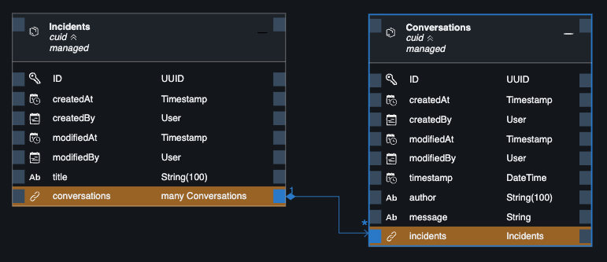

# Exercise 1 - Create the Application

In this exercise, you will build a small application with SAP Cloud Application Programming Model (CAP).
You will use it throughout the exercises

Also, you will get familiar with CAP and the CDS language.

## Create a Project

<!-- 

 -->


## Add Incidents

Create a file `data-model.cds` in the `db` folder.
There, add an `Incidents` entity with a key field `ID` and a `title`.  Choose appropriate types.

> Use code completion (intellisense) to pick a fitting data type.

<details>
<summary>This is how it should like:</summary>

```cds
entity Incidents {
  key ID       : UUID;
  title        : String;
}
```
</details>

## Use Common Predefined Aspects

The situation of `ID` key fields is so common that there is a prebuilt CDS aspect available named `cuid`.  It can be imported with `using ... from '@sap/cds/common';` and used in an entity with the `:` (colon) syntax.

Also, the `Incidents` entity shall carry information on when it was created and updated and by whom.  There is a `managed` aspect from `@sap/cds/common` that does that.

So:
- Replace the hand-crafted `ID` field with `cuid`
- Add the `managed` aspect.


<details>
<summary>This is how it should like:</summary>

```cds
using { cuid, managed } from '@sap/cds/common';

entity Incidents : cuid, managed {
  title        : String;
}
```
</details>

> Take a few moments and check out what the `@sap/cds/common` package has to offer in addition.  In the editor, hold <kbd>Ctrl</kbd> (or <kbd>⌘</kbd>) and hover over the `managed` text.  Click to naviate inside.
See the [documentation](https://cap.cloud.sap/docs/cds/common) for more.


## Add a Conversation History

An incident shall hold a number of messages to build a conversation history.

To create such a relationship, the **graphical CDS modeler** is a great tool.  To open it for the `data-model.cds` file, there two options:
- Right click the `data-model.cds` file.  Select `Open With` > `CDS Graphical Modeler`
- Open the project **Storyboard** through the command palette:
  - <kbd>F1</kbd> > `Open Storyboard`
  - Click on the `Incidents` entity > `Open in Graphical Modeler`

In the canvas, add a `Conversations` entity.
- In the `Aspects` tab in the property sheet, add the `ID` key field from `cuid`.
- Add `timestamp`, `author`, and `message` fields with appropriate types.

Now connect the two entities.  In the `New Relationship` dialog:
- Pick the type so that whenever an `Incident` instance is deleted, all its conversations are deleted as well.
- Stay with the proposed `conversations` and `incidents` fields.


<details open>
<summary>All in all, the entities shall look like this:</summary>



As text, it looks like this:

```cds
entity Incidents : cuid, managed {
  title : String(100);
  conversations : Composition of many Conversations on conversations.incidents = $self;
}

entity Conversations : cuid, managed {
  timestamp : DateTime;
  author : String(100);
  message : String;
  incidents : Association to Incidents;
}
```

</details>


## Create a CDS Service

...

## Start the Application

**Run the application**.  In the terminal, execute in the `incidents` folder:

```sh
cds watch
```

> In the following exercises, always use the `incidents` folder as **working directory** in the terminal (unless stated otherwise).  If you get errors like `no model found`, this usually means you are in the wrong folder.

In SAP Business Application Studio, wait for the little popup in the bottom right corner to appear.  Click **Open in a New Tab**:


It might be that the new browser tab is **blocked**.  If this happens, no worries:
- Unblock future popups from this host.  See the address bar for the little popup manager icon.
- Press <kbd>Ctrl+C</kbd> in the terminal, and run `cds watch` again.

> Tip: You can always open a _running_ application's tab using the _Ports Preview_ command.  Use <kbd>F1</kbd> and type _Ports_ to find the command.

The application should have come up with an address like `https://port4004-workspaces-ws-...applicationstudio.cloud.sap/` (if you work locally, this would be http://localhost:4004).

On the application's index page, go to **Incidents → Fiori preview**, which opens an SAP Fiori elements list page for the `Incidents` entity.  It should look like this:


> With regards to the UI screens that you see here: this is not a tutorial on SAP Fiori.  Instead, we use the minimal screens necessary to illustrate the relevant points.  For a full-fledged SAP Fiori Elements application using CAP, see the [SFlight application](https://github.com/SAP-samples/cap-sflight/).


## Take a Look Behind the Scenes


## Summary

You've now created a basic version of the Incidents Management Application.

Continue to - [Exercise 2 - Exercise 2 Description](../ex2/README.md)

