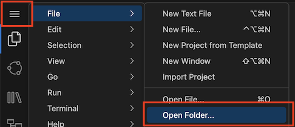
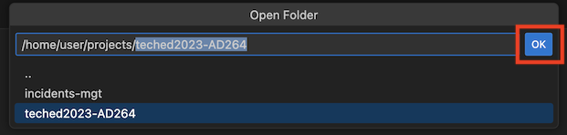
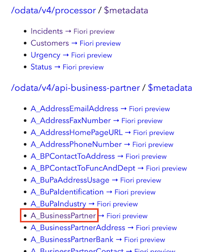
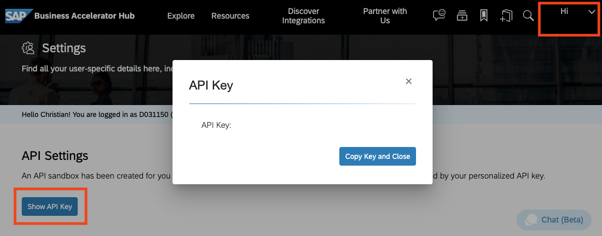

# Exercise 2 - Basic Service Integration

In this exercise, you will add `Customers` to `Incidents` to specify who created an incident.

Customer data is available in _SAP S/4HANA Cloud_ as part of the _Business Partners_ Service.  You will connect to this service from the _Incidents Management_ application.


## Checkout Base Version of the Application

To give you a consistent start for the upcoming tasks, there is a start version of the application available.  It basically matches to what you did in the last exercise plus has some UI bits and pieces.

> We recommend to start from this branch. You can save your previous work by pushing it to a Github repository, for example.

👉 Checkout the `start` branch of the repository:

```sh
cd /home/user/projects
git clone -b start https://github.com/SAP-samples/teched2023-AD264
npm ci  # installs app's dependencies
```

👉 Then open the new folder `teched2023-AD264` in a new window:





> Alternatively, you may use the command _SAP Business Application Studio: Git Clone_


## Add Integration Package

Luckily, you don't need to implement the integration from scratch, but you can use a integration package.
It could come from any provider: SAP, partners, a team in your company etc.

👉 In the terminal, run this to download the package:

```sh
npm add git+https://github.com/SAP-samples/teched2023-AD264#bupa-integration-package
```

> The package was added as a `git` dependency in `package.json`. It could also be a published package from npmjs.com, a tar file from a remote file server, or a local folder.

Let's see what got installed by expanding the folder `node_modules/s4-bupa-integration` (in the file explorer or in the terminal):

```
node_modules/s4-bupa-integration
├── bupa
│   ├── API_BUSINESS_PARTNER.csn
│   ├── API_BUSINESS_PARTNER.edmx
│   ├── API_BUSINESS_PARTNER.js
│   ├── data
│   │   └── API_BUSINESS_PARTNER-A_BusinessPartner.csv
│   └── index.cds
└── package.json
```

You see a bunch of files that will get explained as you progress.

👉 To make the application's CDS model use the package, add this line to the top of `db/data-model.cds`:

```cds
using { API_BUSINESS_PARTNER as S4 } from 's4-bupa-integration/bupa';
```

👉 Register it in the application configuration.  Add this top-level to `package.json` (pay attention to JSON syntax errors):

```jsonc
  "cds": {
    "requires": {
      "API_BUSINESS_PARTNER": {
        "kind": "odata-v2",
        "model": "s4-bupa-integration/bupa"
      }
    }
  }
```


## Service Adaptation

For the first version of the application, you only need two fields from the `A_BusinessPartner` entity. To do this, you create a [_projection_](https://cap.cloud.sap/docs/guides/using-services#model-projections) on the external service. Since in this example, you are interested in business partners in a role as customer, you use the name `Customers` for your projection.

👉 Add `Customers`:
- Create a `Customers` entity as a projection to the `A_BusinessPartner` entity that you have just imported. It shall have two fields
  - `ID` for the remote `BusinessPartner`
  - `name` for the remote `BusinessPartnerFullName`
- Add an association from `Incidents` to (one) `Customer`
- Expose the `Customers` entity similar to `Incidents`

<details>
<summary>This is how it's done:</summary>

Add this to `db/data-model.cds`:

```cds
entity Customers   as projection on S4.A_BusinessPartner {
  key BusinessPartner         as ID,
      BusinessPartnerFullName as name
}
```

Then add:

```cds
entity Incidents {
  ...
  customer      : Association to Customers;
}
```

In `srv/processor-service.cds`, add this line:

```cds
service ... {
  ...
  entity Customers as projection on mgt.Customers;
}
```

</details>


## Test with Mocked Services

👉 Run `cds watch` again and check its ouput. You find the information about what's going on:

```sh
...
  > init from node_modules/s4-bupa-integration/bupa/data/API_BUSINESS_PARTNER-A_BusinessPartner.csv
...
[cds] - mocking API_BUSINESS_PARTNER {
  path: '/odata/v4/api-business-partner',
  impl: 'node_modules/s4-bupa-integration/bupa/API_BUSINESS_PARTNER.js'
}
```

You see that

- The external `API_BUSINESS_PARTNER` is mocked, i.e. served in the application although in production it would come from remote. This is because we haven't specified yet how to connect it to a real remote data source.
- A CSV file `.../data/API_BUSINESS_PARTNER-A_BusinessPartner.csv` with mock data got deployed.<br>Where does it come from?  Yes, the integration package.  See the file tree from the beginning where it's listed.

> `cds watch` runs in a 'mock mode' by default.  In production, this won't happen, as the application is started with `cds-serve`.  See the [documentation](https://cap.cloud.sap/docs/guides/extensibility/composition#testing-locally) for how `cds watch` binds to services.

👉 Go the home page of the application (the one listing all the service endpoints).<br>

You can see the `/odata/v4/api-business-partner` service with all its entities under _Service Endpoints_.
Data is available at `/odata/v4/api-business-partner/A_BusinessPartner`.



## Delegate calls to remote system

To make requests for `Customers` work for real, you need to redirect them to the remote system.

👉 In file `srv/processor-service.js`, add this content to the `init` function:

```js
    // connect to S4 backend
    const S4bupa = await cds.connect.to('API_BUSINESS_PARTNER')
    // delegate reads for Customers to remote service
    this.on('READ', 'Customers', async (req) => {
      console.log(`>> delegating '${req.target.name}' to S4 service...`, req.query)
      const result = await S4bupa.run(req.query)
      return result
    })
```

> Note how you don't need to code against any low-level layer here.  It's just the service name `API_BUSINESS_PARTNER` that is relevant.  The rest is wired up behind the scenes or outside of the application code.  How?  Keep on reading!


## Test with Remote System

As a ready-to-use stand-in for an SAP S4/HANA system, we use the sandbox system of _SAP Business Accelerator Hub_.

> To use your own SAP S/4HANA Cloud system, see this [tutorial](https://developers.sap.com/tutorials/btp-app-ext-service-s4hc-use.html). You don't need it for this tutorial though.

👉 Create a **new file `.env`** in the root folder and add **environment variables** that hold the URL of the sandbox as well as a personal API Key:

```properties
DEBUG=remote
cds.requires.API_BUSINESS_PARTNER.[sandbox].credentials.url=https://sandbox.api.sap.com/s4hanacloud/sap/opu/odata/sap/API_BUSINESS_PARTNER/
cds.requires.API_BUSINESS_PARTNER.[sandbox].credentials.headers.APIKey=<Copied API Key>
```

Note the `[sandbox]` segment which denotes a [configuration profile](https://cap.cloud.sap/docs/node.js/cds-env#profiles) named `sandbox`.  The name has no special meaning.  You will see below how to use it.

👉 Get an **API key**:

- Go to [SAP Business Accelerator Hub](https://api.sap.com).
- On the top right corner, expand the _Hi ..._ dropdown.  Choose _Settings_.
- Click on _Show API Key_. Choose _Copy Key and Close_.

  

👉 **Add the key** to the `.env` file

By putting the key in a separate file, you can exclude it from the Git repository (see the `.gitignore` file).<br>

> Note how the `cds.requires.API_BUSINESS_PARTNER` structure in the `.env file` matches to the `package.json` configuration.<br>
To learn about more configuration options for CAP Node.js applications, see the [documentation](https://cap.cloud.sap/docs/node.js/cds-env).

👉 Now kill the server with <kbd>Ctrl+C</kbd> and run again with the `sandbox` profile activated:

```sh
cds watch --profile sandbox
```

In the server log, you can see that the configuration is effective:

```sh
...
[cds] - connect to API_BUSINESS_PARTNER > odata-v2 {
  url: 'https://sandbox.api.sap.com/s4hanacloud/sap/opu/odata/sap/API_BUSINESS_PARTNER/',
  headers: { APIKey: '...' }
}
...
```

On the application's index page, the **mocked service is gone**, because it is no longer served in the application. Instead, it is assumed to be **running in a remote system**.  Through the configuration above, the system knows how to connect to it.

👉 Open `/odata/v4/processor/Customers` to see the data coming from the remote system.

> If you get a `401` error instead, check your API key in the `.env` file.  After a change in the configuration, kill the server with <kbd>Ctrl+C</kbd> and start it again.

You can also see something like this in the log (due to the `DEBUG=remote` variable from the `.env` file above):

```
[remote] - GET https://.../API_BUSINESS_PARTNER/A_BusinessPartner
  ?$select=BusinessPartner,BusinessPartnerFullName&$inlinecount=allpages&$top=74&$orderby=BusinessPartner%20asc
...
```

This is the remote request sent by the framework when `S4bupa.run(req.query)` is executed.  The **`req.query` object is transparently translated to an OData query** `$select=BusinessPartner,BusinessPartnerFullName&$top=...&$orderby=...`.  The entire HTTP request (completed by the sandbox URL configuration) is then sent to the remote system with the help of **SAP Cloud SDK**.

Note how **simple** the execution of remote queries is.  No manual OData query construction needed, no HTTP client configuration like authentication, no response parsing, error handling, nor issues with hard-wired host names etc.

> See the [documentation on CQN](https://pages.github.tools.sap/cap/docs/cds/cqn) for more on such queries in general.  The [service consumption guide](https://pages.github.tools.sap/cap/docs/guides/using-services#execute-queries) details out how they are translated to remote requests.

> CAP applications use the [SAP Cloud SDK](https://sap.github.io/cloud-sdk/) for HTTP connectivity.  SAP Cloud SDK abstracts authentication flows and communication with SAP BTPs [connectivity, destination, and authentication](https://sap.github.io/cloud-sdk/docs/js/features/connectivity/destination).
It doesn't matter whether you want to connect against cloud or on-premises systems.


## Finish UI

The UI needs some more annotations to show the changed data.

👉 First, some basic annotations that refer to `Customers` itself.  Add it to `app/fiori`:

```cds
annotate service.Customers with @UI.Identification : [{ Value:name }];
annotate service.Customers with @cds.odata.valuelist;
annotate service.Customers with {
  ID   @title : 'Customer ID';
  name @title : 'Customer Name';
};
```

👉 Also in `app/fiori.cds`, add annotations that refer to `Incidents` and its association to `Customers`:

```cds
annotate service.Incidents with @(
  UI: {
    // insert table column
    LineItem : [
      ...up to { Value: title },
      { Value: customer.name, Label: 'Customer' },
      ...
    ],

    // insert customer to field group
    FieldGroup #GeneralInformation : {
      Data: [
        ...,
        { Value: customer_ID, Label: 'Customer'}
      ]
    },
  }
);

// for an incident's customer, show both name and ID
annotate service.Incidents:customer with @Common: {
  Text: customer.name,
  TextArrangement: #TextFirst
};
```

> Don't change the ellipsis `...` in the `cds` code above.  It's a special syntax for refering to the 'remaining values' of array-valued annotations.  The advantage of this syntax is that you do not have to repeat the other table columns.  See the [documentation](https://cap.cloud.sap/docs/cds/cdl#extend-array-annotations) for more.

## Verify in UI

👉 Now Open _Fiori preview_ for the `Incidents` entity.

👉 **Create a new incident** and **select a customer** using the value help. When pressing _Save_, watch the console output of the application and see the `>> delegating to S4 service...` message.

## Summary

You have added basic capabilities to call out to a remote service.

Continue to [exercise 3](../ex3/README.md) to see how this can be enhanced.
