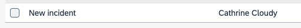

# Exercise 3: Replication and Events

In the incidents list, the application shall display (remote) customer data together with (application-local) incident data.
This raises a **performance issue**: when showing potentially hundreds of incidents, shall the app reach out to the remote system at all?  Or just for single records, for all records at once, or for a chunk of records?

We use a different approach by **replicating remote data on demand**.

The scenario will look like this:
- The user enters a new incident and selects the customer through the value help.  The value help shows only _remote_ customer data.
- As soon as the incident record is created, the customer data is written to a local replica table.
- Further requests for the incident's customer are served from this replica table.
- Replicated records will be updated if a remote customer changes.

👉 Start by **adding a persistent table** for the replicas.  This can be done with just one line in `db/data-model.cds`:

```cds
annotate Customers with @cds.persistence: { table,skip:false };
```

The annotation `@cds.persistence: {table,skip:false}` turns the view above into a table with the same signature (`ID` and `name` columns).  See the [documentation](https://cap.cloud.sap/docs/cds/annotations#persistence) for more on annotations that influence persistence.

> You could have added the annotation directly to the `Customers` definition.  The result would be the same.  With the [`annotate` directive](https://cap.cloud.sap/docs/cds/cdl#the-annotate-directive) though, you get the power to enhance entities (even external/base/reuse entities!) at different places in your application.

## Replicate Data On Demand

Now there is code needed to replicate the customer record whenever an incident is created.

👉 In file `srv/processor-service.js`, add this code (to the `init` function):

```js
  const db = await cds.connect.to('db')                // our primary database
  const { Customers }  = db.entities('incidents.mgt')  // CDS definition of the Customers entity

  this.after (['CREATE','UPDATE'], 'Incidents', async (data) => {
    const { customer_ID: ID } = data
    if (ID) {
      const replicated = await db.exists (Customers,ID)
      if (!replicated) {
        console.log ('>> Updating customer', ID)
        const customer = await S4bupa.read (Customers,ID)
        await INSERT(customer) .into (Customers)
      }
    }
  })
```

👉 Now create an incident in the UI.  Don't forget to select a customer through the value help.<br>
In the log, you can see the `>> Updating customer` line, confirming that replication happens.

## Test without UI

With the [REST client for VS Code](https://marketplace.visualstudio.com/items?itemName=humao.rest-client), you can conveniently test the same flow without the UI.

👉 Create a file `tests.http` with this content:

```
###
# @name IncidentsCreate

POST http://localhost:4004/odata/v4/processor/Incidents
Content-Type: application/json

{
  "title": "New incident",
  "customer_ID": "Z100001"
}

###
@id = {{IncidentsCreate.response.body.$.ID}}

POST http://localhost:4004/odata/v4/processor/Incidents(ID={{id}},IsActiveEntity=false)/draftActivate
Content-Type: application/json
```

👉 Click `Send Request` above the `POST .../Incidents` line. This will create the record in a draft tate.<br>
👉 Click `Send Request` above the `POST .../draftActivate` line. This corresponds to the `Save` action in the UI.

  > This second request is needed for all changes to entities managed by [SAP Fiori's draft](https://cap.cloud.sap/docs/advanced/fiori#draft-support) mechanism.

You should see the same `>> Updating customer` server log.


## Event-based Replication

We haven't discussed yet how to _update_ the cache table holding the `Customers` data.  We'll use _events_ to inform our application whenever the remote BusinessPartner has changed.

Let's see what the integration package provides.

👉 Open `node_modules/s4-bupa-integration/bupa/index.cds`

<details>
<summary>Quick question: how can you jump to this file real quick?</summary>

Use the `cds watch` output in the console. The file is listed there because it is loaded when the application starts.

<kbd>Ctrl+Click</kbd> on the file to open it:


</details>

<p>

There, you can see that event definitions for `BusinessPartner` are available:

```cds
event BusinessPartner.Created @(topic : 'sap.s4.beh.businesspartner.v1.BusinessPartner.Created.v1') {
  BusinessPartner : S4.A_BusinessPartner:BusinessPartner;
}
event BusinessPartner.Changed @(topic : 'sap.s4.beh.businesspartner.v1.BusinessPartner.Changed.v1') {
  BusinessPartner : S4.A_BusinessPartner:BusinessPartner;
}
```

The benefits of these 'modeled' event definitions are:
- [CAP's support for events and messaging](https://cap.cloud.sap/docs/guides/messaging) can automatically _subscribe_ to message brokers and _emit_ events behind the scenes.
- Also, event names like `BusinessPartner.Changed` are semantically closer to the domain and easier to read than the underlying technical events like `sap.s4.beh.businesspartner.v1.BusinessPartner.Changed.v1`.


## React to Events

To close the loop, add code to **consume events**.

👉 In `srv/processor-service.js`, add this event handler:

```js
    // update cache if BusinessPartner has changed
    S4bupa.on('BusinessPartner.Changed', async ({ event, data }) => {
      console.log('<< received', event, data)
      const { BusinessPartner: ID } = data
      const customer = await S4bupa.read (Customers, ID)
      let exists = await db.exists (Customers,ID)
      if (exists)
        await UPDATE (Customers, ID) .with (customer)
      else
        await INSERT.into (Customers) .entries (customer)
    })
```

## Emitting Events from Mocked Services

But who is the **event emitter**?  Usually it's the remote data source, i.e. the SAP S4/HANA system.  For local runs, it would be great if something could **emit events when testing**.  Luckily, there is alreday a simple event emitter in the integration package!

👉 Open file `node_modules/s4-bupa-integration/bupa/API_BUSINESS_PARTNER.js`.<br>
You know how you can open it real quick, don't you? :)

It uses the [`emit` API](https://cap.cloud.sap/docs/node.js/core-services#srv-emit-event) to send out an event:

```js
  ...
  this.after('UPDATE', A_BusinessPartner, async data => {
    const event = { BusinessPartner: data.BusinessPartner }
    console.log('>> BusinessPartner.Changed', event)
    await this.emit('BusinessPartner.Changed', event);
  })
  this.after('CREATE', A_BusinessPartner, ...)
```

This means whenever you change or create data through the `API_BUSINESS_PARTNER` mock service, a local event is emitted.
Also note how the event name `BusinessPartner.Changed` matches to the event definition from the CDS code above.

## Put it all together

Before starting the application again, it's time to turn the current in-memory database into a persistent one.  This way, data is not reset after each restart, which is useful if you added data manually.

👉 So, kill `cds watch`, then execute:

```sh
cds deploy --with-mocks --to sqlite
```

> This deploys the current SQL equivalent of your CDS model to a persistent database.  This also means that after changes to the data model (new fields, entities etc.), you need to execute the `cds deploy ...` command again.  Keep this in mind in case you see errors like _table/view not found_.

<!-- You might also want to open the `db.sqlite` file and inspect the contents of the database:
 -->


👉 Start the application with a hint to use a SQLite database (which in this case means a persistent DB):

```sh
CDS_REQUIRES_DB=sqlite cds watch
```

> `CDS_REQUIRES_DB=sqlite` has the same effect as `"cds": { "requires": { db:"sqlite" } }` in `package.json`, only that the latter is a permanent setting.

The application runs as before.  In the log, however, you no longer see a database deployment, but a line like:

```sh
...
[cds] - connect to db > sqlite { url: 'db.sqlite' }
...
```

👉 In your file `tests.http`, first execute the 2 requests to **create an incident** again (see [section above](#test-without-ui)).

Now **change customer** `Z100001` with an HTTP request. Add this request to the `http` file:

```
###
PUT http://localhost:4004/odata/v4/api-business-partner/A_BusinessPartner/Z100001
Authorization: Basic carol:
Content-Type: application/json

{
  "BusinessPartnerFullName": "Albus Percival Wulfric Brian Dumbledore"
}
```

👉 After clicking `Send Request` above the `PUT ...` line, you should see both the event being emitted as well as received:

```
>> BusinessPartner.Changed { BusinessPartner: 'Z100001' }
<< received BusinessPartner.Changed { BusinessPartner: 'Z100001' }
```

The SAP Fiori UI also reflects the changed data in the incidents list:



> Note that we can't test the event roundtrip in the `cds watch --profile sandbox` mode, as the sandbox system of _SAP Business Accelerator Hub_ does not support modifications.  You would need to use a dedicated SAP S/4HANA system here.  See this [tutorial](https://developers.sap.com/tutorials/btp-app-ext-service-s4hc-register.html) for how to register your own SAP S/4HANA system.


## Summary

In this and the last exercise, you've learned how to add an integration package.  You've also seen that quite some application code could be avoided, namely:

- The BusinessPartner API description for the structure (entities, types etc), as CDS model
- The BusinessPartner event definitions, as CDS model
- The service mock implementation and sample data
- Event emitters for local testing

Depending on the application scenario, more and higher-level features can be added in such packages, like

- CDS projections for model parts that are often used, like a `Customers` definition.
- Additional annotations, like for SAP Fiori Elements
- Translated content like i18n files

The following picture shows how the integration/reuse package and the application project work together on a technical level.


Let's do a general [wrap-up](../summary/) of what you have seen.
